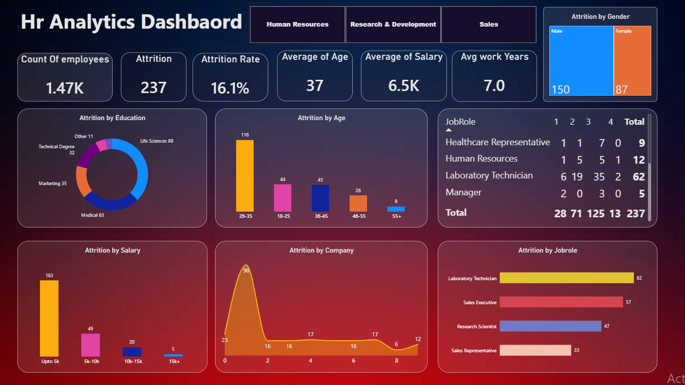

# HR Analytics Dashboard

An interactive dashboard that analyzes **employee attrition** across an organization. It helps HR teams understand *who* is leaving, *when* they leave, and *which roles and groups* are most affected, so they can make data-driven retention decisions.



## Objective

Identify the key drivers of employee turnover by breaking attrition down by demographics, education, salary, tenure, and job role.

## Key Metrics (KPIs)

| Metric | Value |
|---|---|
| Total Employees | 1.47K |
| Attrition (employees who left) | 237 |
| Attrition Rate | 16.1% |
| Average Age | 37 |
| Average Salary | 6.5K |
| Average Work Years | 7.0 |

## Dashboard Components

- **Department Slicers**: filter the whole report by *Human Resources*, *Research & Development*, or *Sales*.
- **Attrition by Gender**: treemap comparing Male (150) and Female (87) attrition.
- **Attrition by Education**: donut chart by education field. Life Sciences (89) and Medical (63) are the largest, followed by Marketing (35), Technical Degree (32), and Other (11).
- **Attrition by Age**: column chart by age group. The 26-35 group leads with 116, followed by 18-25 (44), 36-45 (43), 46-55 (26), and 55+ (8).
- **Attrition by Salary**: column chart by salary band. Most leavers are in the lowest band, *Up to 5K* (163), then 5K-10K (49), 10K-15K (20), and 15K+ (5).
- **Attrition by Company (Tenure)**: area chart showing attrition by years at the company, with a sharp peak early on (98 leavers at year 1).
- **Attrition by Job Role**: bar chart. Laboratory Technician (62), Sales Executive (57), Research Scientist (47), and Sales Representative (33) have the highest attrition.
- **Job Role Matrix**: table of attrition by job role across rating levels 1-4, with totals.

## Key Insights

- **Overall attrition is 16.1%** (237 of ~1,470 employees).
- **Young employees leave the most.** The 26-35 age group accounts for nearly half of all attrition.
- **Low pay is linked to higher attrition.** About 69% of leavers (163 of 237) earn up to 5K.
- **Early-tenure risk.** Attrition spikes within the first years of employment, peaking at year 1.
- **Male employees** account for a larger share of attrition (150) than female employees (87).
- **Laboratory Technicians and Sales roles** are the most affected job roles.
- **Life Sciences and Medical backgrounds** make up the majority of leavers by education field.

## Recommendations

- Review compensation for entry-level and lower-salary bands.
- Strengthen onboarding and engagement programs during the first 1-2 years.
- Investigate working conditions in high-attrition roles (Laboratory Technician, Sales Executive).
- Create career-growth paths for employees aged 26-35.

## Tools & Technologies

- **Power BI** for data modeling, DAX measures, and interactive visuals
- Data cleaning and transformation (Power Query / SQL / Python)

## Repository Structure

```
├── HR_Analytics.pbix      # Power BI report
├── dataset/               # Source data
├── dashboard.png          # Dashboard screenshot
└── README.md
```

## How to Use

1. Clone this repository.
2. Open `HR_Analytics.pbix` in Power BI Desktop.
3. Use the department slicers and click any chart to cross-filter the report.

## Author

**Muhammed Ahmed**: Data Engineer & Analyst
